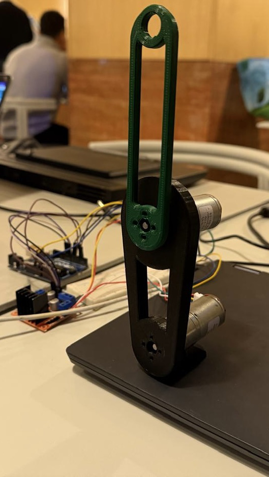
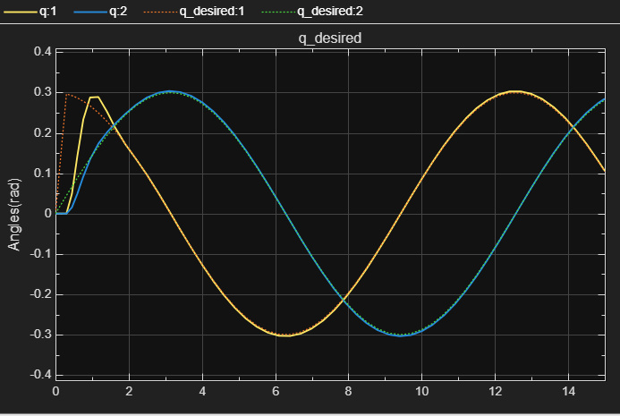
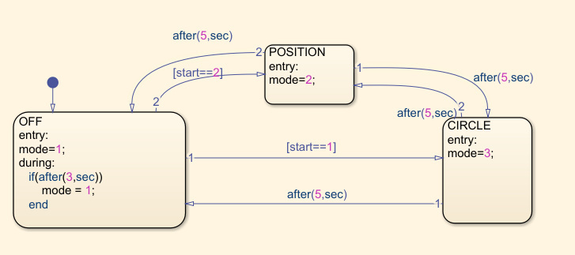
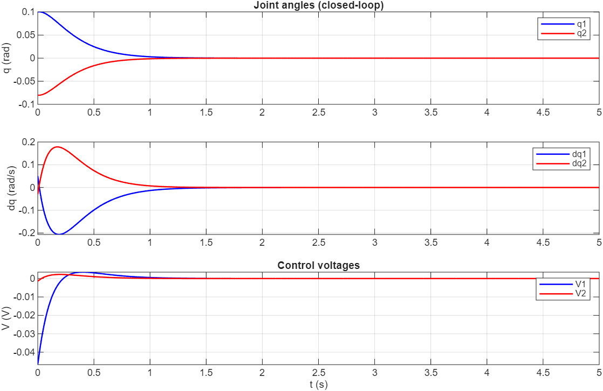
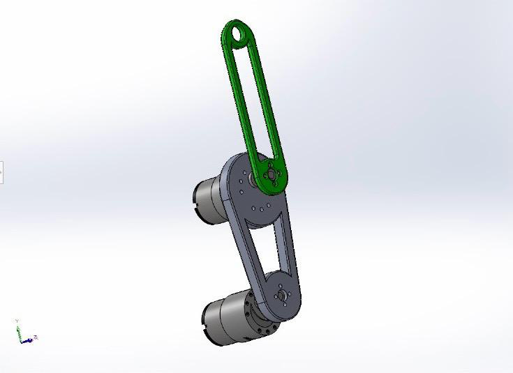
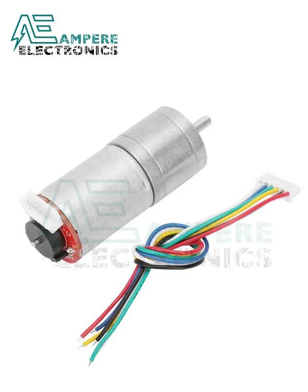
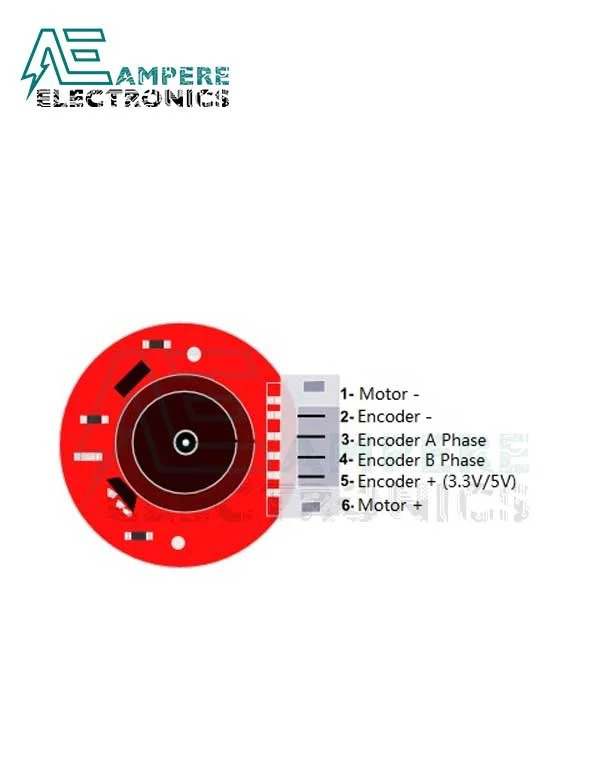

# Non-Linear Control of a 2-DOF Robotic Arm

[](LICENSE)
[](https://www.python.org/)
[](https://www.mathworks.com/products/simulink.html)
[](https://www.arduino.cc/)
[](https://github.com/andrew-abdelmalak/2-dof-robotic-arm-control-system/actions)

Complete design, simulation, and hardware implementation of a non-linear controlled two-degree-of-freedom (2-DOF) planar robotic arm. The project covers mathematical modeling using the Euler–Lagrange formulation, non-linear stability analysis via Lyapunov methods, feedback linearization control synthesis, MATLAB/Simulink simulation, and real-time embedded implementation on an Arduino microcontroller.

> **Paper** — *Non-Linear Control of a 2-DOF Robotic Arm: Complete Design, Simulation, and Hardware Implementation* ([PDF](docs/Nonlinear_Control_2DOF_Arm.pdf))

<p align="center">
  
</p>
<p align="center"><em>Fully assembled 2-DOF robotic arm prototype with 3D-printed PLA+ links, 25GA370 DC gear motors, L298N driver, and Arduino Mega 2560.</em></p>

---

## Table of Contents

- [Overview](#overview)
- [Key Results](#key-results)
- [Hardware](#hardware)
- [Simulation Results](#simulation-results)
- [Hardware Design](#hardware-design)
- [Repository Structure](#repository-structure)
- [MATLAB Workflow](#matlab-workflow)
- [Arduino Workflow](#arduino-workflow)
- [Authors](#authors)
- [References](#references)
- [License](#license)

---

## Overview

The system controls a planar 2-DOF arm with joint variables $q = [q_1, q_2]^T$ governed by the Euler–Lagrange equation:

$$M(q)\ddot{q} + C(q, \dot{q})\dot{q} + G(q) + D\dot{q} = \tau$$

A **feedback linearization** controller cancels all non-linear terms, producing a linearized closed-loop system. The control law computes:

$$\tau_{\text{des}} = M(q)\ddot{q}_r + C(q,\dot{q})\dot{q} + G(q) + (D + \beta)\dot{q}$$

with reference acceleration $\ddot{q}_r = \ddot{q}_d + K_p e + K_d \dot{e}$, where $e = q_d - q_m$.

**Lyapunov stability** is guaranteed via $V = \tfrac{1}{2}e^T K_p e + \tfrac{1}{2}\dot{e}^T\dot{e}$, yielding $\dot{V} = -\dot{e}^T K_d \dot{e} \leq 0$.

### Key Results

| Metric | Value |
|--------|-------|
| Steady-state position error | < 0.01 rad |
| Circular trajectory phase error | < 0.02 rad |
| Amplitude error | < 1 % |
| Control loop rate | 100 Hz (10 ms) |
| Controllability rank | 4 (full) across entire workspace |

### Hardware

| Component | Specification |
|-----------|---------------|
| **Motors** | 25GA370 DC gear motor, 12 V, 50:1 gear ratio, 0.44 N·m stall torque |
| **Encoders** | Integrated quadrature, 550 counts/rev |
| **Controller** | Arduino Mega 2560 |
| **Driver** | L298N dual H-bridge (2.5–46 V, 2 A/channel) |
| **Links** | 3D-printed PLA+, SolidWorks-designed |

---

## Simulation Results

### Position Regulation

Two gain configurations were compared for step response ($q_d = [0.5, 0.5]$ rad):

| Characteristic | Low Gains ($K_p = 5$, $K_d = 1$) | High Gains ($K_p = 10$, $K_d = 3$) |
|----------------|----------------------------------|-------------------------------------|
| Overshoot | ~0.05 rad | ~0.01 rad |
| Settling time | ~3 s | ~1.5 s |
| Control effort | Low | High |
| Noise sensitivity | Low | High |

### Circular Trajectory Tracking

End-effector commanded to trace a circle of radius $R = 0.3$ m at $\omega = 0.5$ rad/s. Measured joint angles track desired references with phase error < 0.02 rad.

<p align="center">
  
</p>
<p align="center"><em>Circular trajectory tracking: measured joint angles (solid) closely follow desired references (dashed) with minimal phase lag.</em></p>

### Hybrid Mode (Position → Trajectory)

The full sequence (OFF → POSITION → CIRCLE) demonstrates seamless mode transitions managed by a Stateflow state machine:

<p align="center">
  
</p>
<p align="center"><em>Stateflow state machine governing mode transitions: OFF → POSITION → CIRCLE.</em></p>

<p align="center">
  
</p>
<p align="center"><em>Closed-loop equilibrium response: joint angles converge to zero (top), velocities decay (middle), and control voltages settle (bottom).</em></p>

---

## Hardware Design

<p align="center">
  
</p>
<p align="center"><em>SolidWorks CAD assembly showing both links, motor housings, and mounting points.</em></p>

<p align="center">
  &emsp;
  
</p>
<p align="center"><em>Left: 25GA370 DC gear motor with integrated quadrature encoder. Right: 6-pin encoder interface (Motor±, Encoder±, channels A/B).</em></p>

### Embedded Control Loop (Arduino)

```
1. Read encoder counts → compute joint angles: q = 2π · count / 550
2. Estimate velocities via filtered finite differences:
   q̇_filt[k] = 0.7·q̇_filt[k-1] + 0.3·Δq/Ts
3. Evaluate state machine (OFF / POS / CIRCLE), generate references
4. Execute feedback linearization → compute τ_des → convert to PWM
5. Apply saturation (±12 V) → output to L298N
```

## Repository Structure

```
.
|-- matlab/
|   |-- Advanced_trial.slx
|   |-- init_params.m
|   |-- check_controllability.m
|   `-- check_nonlinear_controllability_lie.m
|-- arduino/
|   |-- end_effector_circle/
|   |   `-- end_effector_circle.ino
|   |-- joint_space/
|   |   `-- joint_space.ino
|   |-- nonlinear_trajectory/
|   |   `-- nonlinear_trajectory.ino
|   `-- nonlinear_trajectory_alt/
|       `-- nonlinear_trajectory_alt.ino
`-- docs/
    |-- Nonlinear_Control_2DOF_Arm.pdf
    `-- figures/                        # Extracted from the report
```

## MATLAB Workflow

1. Open MATLAB in the `matlab/` directory.
2. Run `init_params.m` to initialize arm and motor parameters.
3. Execute:
   - `check_controllability.m`
   - `check_nonlinear_controllability_lie.m`
4. Open `Advanced_trial.slx` for simulation and controller testing.

## Arduino Workflow

1. Open one sketch folder under `arduino/` in Arduino IDE.
2. Select the board and COM port matching your hardware.
3. Upload one of the control sketches:
   - `end_effector_circle.ino`
   - `joint_space.ino`
   - `nonlinear_trajectory.ino`
   - `nonlinear_trajectory_alt.ino`

`nonlinear_trajectory_alt` is preserved as an alternate trajectory/controller variant.

## Notes

- This repository intentionally keeps multiple controller implementations to compare behavior across trajectory spaces and tuning choices.
- Update pin definitions and hardware constants in each sketch before deployment if your wiring differs.

## Authors

| Name | Affiliation |
|------|-------------|
| **Ahmed Mostafa** | Mechatronics Engineering, GUC |
| **Andrew Abdelmalak** | Mechatronics Engineering, GUC |
| **Hazim Alwakad** | Mechatronics Engineering, GUC |
| **Mazen Amr** | Mechatronics Engineering, GUC |
| **Samir Yacoub** | Mechatronics Engineering, GUC |
| **Youssef Youssry** | Mechatronics Engineering, GUC |

## Acknowledgments

The authors thank **Prof. Ayman A. El-Badawy** and **Eng. Karim Abdelsalam** for their guidance and instruction throughout this project.

## Report

The full project report is available in [`docs/Nonlinear_Control_2DOF_Arm.pdf`](docs/Nonlinear_Control_2DOF_Arm.pdf).

## References

1. J. E. Slotine and W. Li, *Applied Nonlinear Control*, Prentice-Hall, 1991.
2. M. W. Spong, S. Hutchinson, and M. Vidyasagar, *Robot Modeling and Control*, 2nd ed., Wiley, 2020.
3. B. Siciliano *et al.*, *Robotics: Modelling, Planning and Control*, Springer, 2009.
4. A. A. El-Badawy, "Advanced Mechatronics Tutorial Notes," GUC, 2025.
5. Ampere Electronics, "25GA370 DC gear motor with encoder specifications," 2023.
6. V. H. Benitez *et al.*, "Design of an affordable IoT open-source robot arm for online teaching," *HardwareX*, 8, 2020.

## License

Released under the MIT License. See [LICENSE](LICENSE).
